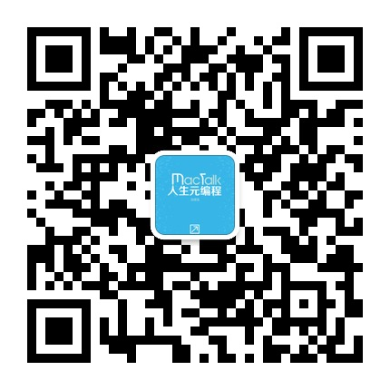

# Wechat-Rcommend
>互联网相关微信订阅号推荐；

>随着博客的落寞，微信的兴起，利用零碎时间阅读已成为一种习惯；

>微信订阅号是一种当下流行的阅读方式；

>本项目指在推荐互联网相关的订阅号；

>如果你有想推荐的请Fork，然后Pull requests；

1. 坏时代

微信号：TheBadTime

简介：小道消息2.0版本

作者：Fenng(冯大辉)

二维码：

1. MacTalk

微信号：sagacity-mac

简介：讲述技术与人文故事，释放编程与写作力量。

作者：池建强

二维码：

